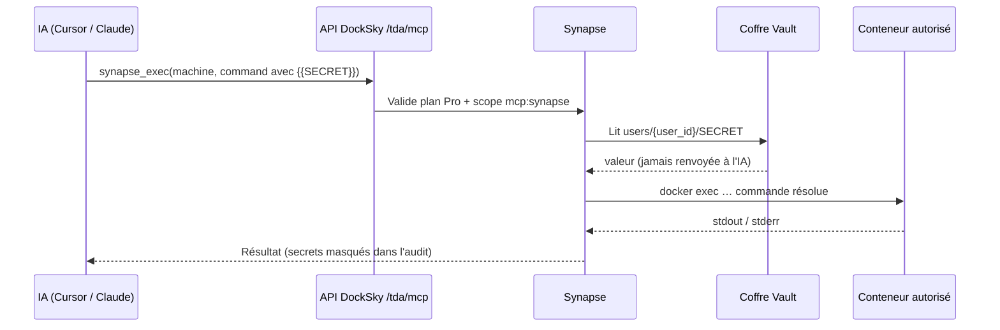

# Pilotage IA (Synapse)

**Pilotage IA** est le nom affiché dans DockSky App pour **Synapse** : un proxy d'exécution shell sécurisé qui permet à ton IA d'agir sur ton infrastructure **sans jamais voir tes mots de passe**.

L'IA envoie des commandes avec des placeholders `{{NOM}}`. Le serveur DockSky remplace les secrets côté serveur, exécute la commande dans un conteneur autorisé, et journalise le résultat — avec les valeurs secrètes masquées.

---

## À quoi ça sert

| Besoin | Sans Synapse | Avec Synapse |
|--------|--------------|--------------|
| Vérifier une BDD | Tu copies le MDP dans le chat IA | `mysql -u {{DB_USER}} -p{{DB_PASS}} …` |
| Inspecter un conteneur | Tu te connectes en SSH manuellement | L'IA lance `docker exec …` pour toi |
| Déboguer en session | Tu alternes entre Cursor et le terminal | L'IA exécute via MCP, tu lis le journal dans l'app |

Synapse ne remplace pas ton terminal : il donne à l'IA un canal **contrôlé, audité et sans fuite de secrets**.

---

## Architecture simplifiée

---

## Ce qui est dans DockSky App aujourd'hui

Tout se configure dans **Menu Vue → Paramètres**, en bas de page :

| Section | Rôle |
|---------|------|
| **Accès IA** | Génère le token MCP (`dk_ai_…`) pour Cursor ou VS Code |
| **Coffre Pilotage IA** | Crée et supprime tes secrets personnels |
| **Mes machines Synapse** | Définit où l'IA peut exécuter (slug + conteneurs) |
| **Journal Synapse** | Affiche les 30 dernières exécutions (lecture seule) |

:::info Pas de bouton « Exécuter » dans l'app
L'exécution passe par l'IA connectée en MCP (`synapse_exec`) ou par l'API REST. L'app sert à **configurer** et **surveiller**, pas à lancer des commandes à la main.
:::

---

## Prérequis

1. **Plan Pro DockSky App** (`pro` ou `personal`) — requis pour créer des secrets, des machines et exécuter des commandes
2. **Token IA** généré dans Paramètres → Accès IA
3. **Au moins une machine** enregistrée avec des conteneurs autorisés
4. **Secrets** dans le coffre pour chaque placeholder utilisé dans les commandes

Sans plan Pro, les sections Pilotage IA sont grisées et une bannière t'indique de passer au plan Pro.

---

## Parcours type (5 minutes)

1. Passe au **plan Pro** si ce n'est pas déjà fait
2. **Paramètres → Accès IA** : génère un token, copie-le immédiatement
3. **Paramètres → Coffre Pilotage IA** : enregistre `DB_USER`, `DB_PASS`, etc.
4. **Paramètres → Mes machines Synapse** : crée une machine (ex. slug `docksky-vps`, conteneurs `docksky_api_dev`)
5. Configure **Cursor** ou **VS Code** avec le serveur MCP DockSky → voir [Synapse et MCP](./synapse-mcp-cursor)
6. Demande à ton IA d'exécuter une commande de test
7. Vérifie le résultat dans **Journal Synapse**

---

## Pages détaillées

| Page | Contenu |
|------|---------|
| [Secrets et machines](./synapse-secrets-et-machines) | Règles de nommage, coffre, machines, journal |
| [Synapse et MCP](./synapse-mcp-cursor) | Configuration Cursor/VS Code, outils MCP, scopes |
| [Agent distant](./synapse-agent-distant) | Machine type `agent` sur un VPS personnel (avancé) |

---

## Sécurité — principes clés

- Les **valeurs** des secrets ne quittent jamais le serveur et ne sont **jamais** affichées dans l'app ni renvoyées à l'IA
- Seuls les **noms** de secrets sont listables (`DB_USER`, pas sa valeur)
- Les commandes exécutables sont limitées aux **conteneurs** que tu as déclarés sur ta machine
- Chaque exécution est **journalisée** (template de commande, stdout masqué, code de sortie)
- Limite de **30 exécutions par minute** par utilisateur (configurable côté infra)

---

## Limitations connues

| Sujet | État actuel |
|-------|-------------|
| Exécution depuis l'app | Non — MCP ou API uniquement |
| Machines type `agent` (VPS distant) | API/MCP seulement, pas encore dans l'UI app |
| Scope `mcp:synapse` sur le token IA | Non configurable dans l'app — voir [Synapse et MCP](./synapse-mcp-cursor#scopes-du-token-ia) |
| Plan gratuit | Lecture API possible ; écriture et exec bloquées (403) |

---

## Pour aller plus loin (technique)

La spécification complète et l'architecture des dépôts sont sur le repo projet : [github.com/DockSky/synapse](https://github.com/DockSky/synapse).
