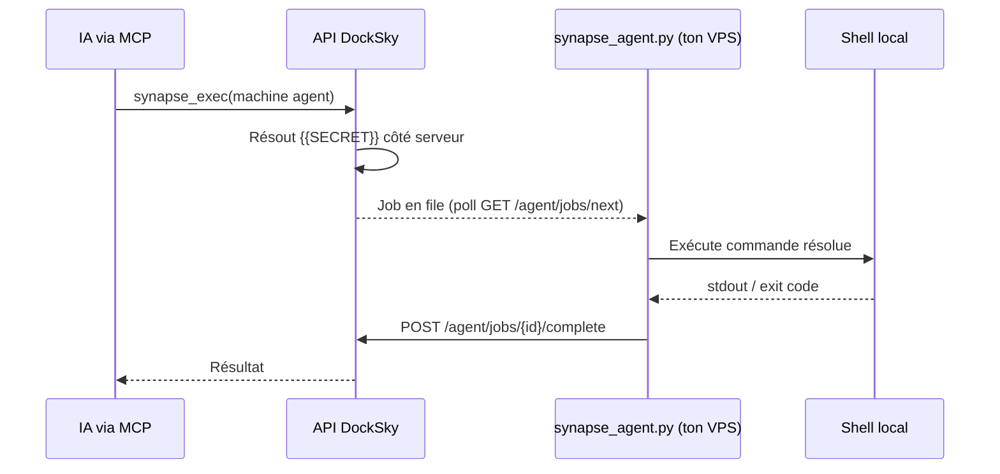

# Agent Synapse distant (avancé)

Par défaut, Synapse exécute des commandes via **Docker** sur l'infra DockSky (`machine_type: docker_local`). Pour piloter un **serveur personnel** (ton VPS, ta machine de dev), Synapse propose le type de machine **`agent`**.

:::info Agent distant dans l'app
Depuis **Paramètres → Mes machines Synapse**, tu peux choisir le type **Agent distant (VPS perso)**. Le **token agent** s'affiche **une seule fois** à la création — copie-le immédiatement.
:::

---

## Principe



1. Tu crées une machine `agent` via API/MCP
2. L'API te renvoie un **`agent_token`** (affiché **une seule fois**)
3. Tu lances `synapse_agent.py` sur ton serveur avec ce token
4. L'agent envoie des heartbeats et récupère les jobs en attente
5. Les commandes arrivent **déjà résolues** (secrets injectés côté DockSky)

---

## Créer une machine agent

`POST https://api.docksky.fr/synapse/machines`  
Auth: `Authorization: Bearer <JWT>` — plan **Pro** requis.

```json
{
  "slug": "mon-vps-maison", "label": "VPS perso Robert", "machine_type": "agent", "allowed_containers": ["local"], "default_container": "local", "host_hint": "192.168.1.50"
}
```

La réponse inclut `agent_token` — **copie-le immédiatement**, il ne sera plus affiché.

Équivalent MCP: outil `synapse_create_machine` avec `"machine_type": "agent"` (scope `mcp:synapse` requis).

---

## Installer l'agent sur le serveur distant

Le script est dans le dépôt `docksky-api`: `scripts/synapse/agent.py`.

```bash
export SYNAPSE_API_URL=https://api.docksky.fr
export SYNAPSE_AGENT_TOKEN=<agent_token reçu à la création>
# Optionnel: intervalle de poll (défaut 3 s)
export SYNAPSE_AGENT_POLL_SECONDS=3

python3 scripts/synapse/agent.py
```

L'agent:
- Envoie `POST /synapse/agent/heartbeat` régulièrement
- Récupère les jobs via `GET /synapse/agent/jobs/next`
- Exécute la commande en shell local
- Rapporte le résultat via `POST /synapse/agent/jobs/{id}/complete`

Authentification agent: header **`X-Synapse-Agent-Token`** (pas le token IA `dk_ai_`).

---

## Endpoints agent (référence)

| Méthode | Chemin | Auth |
|---------|--------|------|
| `POST` | `/synapse/agent/heartbeat` | `X-Synapse-Agent-Token` |
| `GET` | `/synapse/agent/jobs/next` | `X-Synapse-Agent-Token` |
| `POST` | `/synapse/agent/jobs/{id}/complete` | `X-Synapse-Agent-Token` |

---

## Sécurité

- Le **token agent** est distinct du token IA MCP
- Un agent ne voit que les jobs destinés à **sa** machine
- Les secrets sont résolus **sur le serveur DockSky** avant envoi au job, l'agent reçoit la commande finale, pas les placeholders
- Révoque une machine compromise via `DELETE /synapse/machines/{slug}` (l'agent ne pourra plus s'authentifier)

---

## Quand utiliser `docker_local` vs `agent`

| Type | Cas d'usage |
|------|-------------|
| `docker_local` | Conteneurs sur l'infra DockSky (`mon_app`, `ma_base_mysql`, …): **cas le plus courant** |
| `agent` | Ton propre VPS, poste de dev hors infra DockSky, réseau local |

Pour la majorité des utilisateurs DockSky App, **`docker_local` via l'interface Paramètres** suffit.

---

## Voir aussi

- [Pilotage IA, vue d'ensemble](./pilotage-ia-synapse)
- [Secrets et machines](./synapse-secrets-et-machines)
- [Synapse et MCP](./synapse-mcp-cursor)
